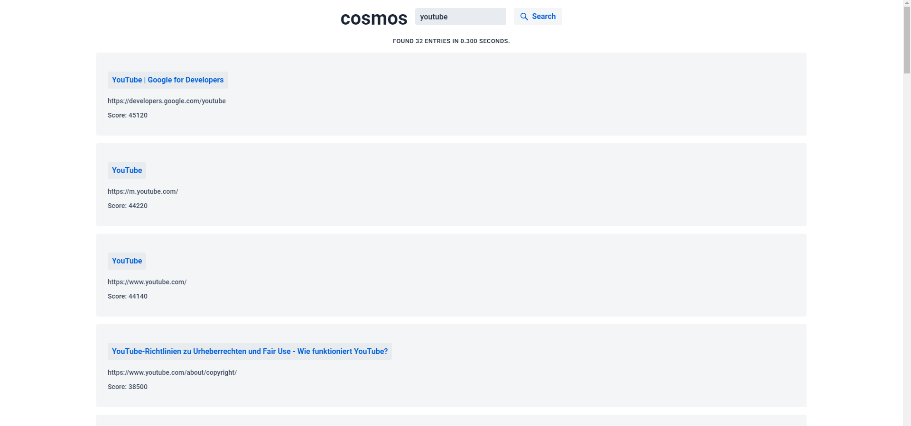

**Cosmos** is an experimental WebCrawler + SearchEngine written in Java.
Using HTML WebScraping and a set of Seed URLs **Cosmos** crawls through the web to index URLs.

> [!important]
> Please keep in mind, that this is a short-term project. Written within a few days.
> If you look up the source code, you might find some nasty stuff...
> I only created this project, because I was interested in the idea of a **WebCrawler** and wanted to explore it...
> In the end, this is more of an experiment rather than a sufficient product!

# Featuring

Indexes 20,000+ Webpages using 1,000,000+ Indicies within 15 Minutes!

# Screenshot

